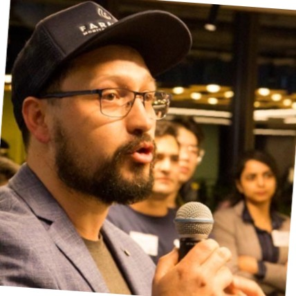

# 

🛠️ Helping Teams Engineer Quality: 🗣️ Product Owner for Quality: Head of Quality Engineering and Observability

| [Contact me](mailto:alejandrosanchezau@yahoo.com.au) | [Follow me on LinkedIn](https://www.linkedin.com/in/alejandrosanchezgiraldo){:target="\_blank"} | [Portfolio](https://github.com/ale-sanchez-g?tab=repositories){:target="\_blank"}

### Personal Statement

I am an accomplished Product Owner for Quality with a profound dedication to embedding engineering excellence into all aspects of my work. I firmly hold the belief that quality should be upheld as a collective responsibility, and I derive great satisfaction from collaborating with teams to foster a culture rooted in exceptional standards. Moreover, I am a staunch advocate for data-driven decision-making, recognizing it as the sole influencer essential for the triumph of any product.

With over 15 years of invaluable experience, I have built my expertise in developing engineering capabilities across a diverse range of industries. My professional journey has encompassed sectors including Telecommunications, Airlines, Media, Loyalty, Insurance, Financial Services, and AgriTech, in both Enterprise and Start-up environments. This extensive background has allowed me to gain comprehensive insights into the unique challenges and intricacies associated with each industry, equipping me with a versatile skill set that adapts to various organizational landscapes.

### Achievements

• 📈 Create and deliver a strategic roadmap to evolve from testing services into Quality Engineering capabilities

• 🙋‍♂️ Leading and developing teams towards building quality in their delivery process.

• 🛠️ Exploring DevSecOps tools to enable self-service for quality capabilities.

• 👁️ Strengthening Observability practices to enable faster and secure engineering

[Work Experience](/reference/WORKEXPERIENCE.MD)

[Publications](/reference/PUBLICATIONS.MD)

[Conferences](/reference/CONFERENCES.MD)

[Learning](/reference/LEARNING.MD)

[Support](/support/SUPPORTLIST.MD)

### Interest

In addition to my extensive experience, I have developed a keen interest in emerging fields and technologies that are shaping the future of engineering. I have actively pursued knowledge and expertise in areas such as Artificial Intelligence (AI), Prompt Engineering, Observability, and Community engagement. These areas have become integral components of my professional growth, as I recognize their potential to revolutionize the way we approach quality engineering and product development. By staying ahead of the latest advancements and actively engaging with communities of like-minded professionals, I continually strive to expand my horizons and contribute to the forefront of cutting-edge engineering practices.
